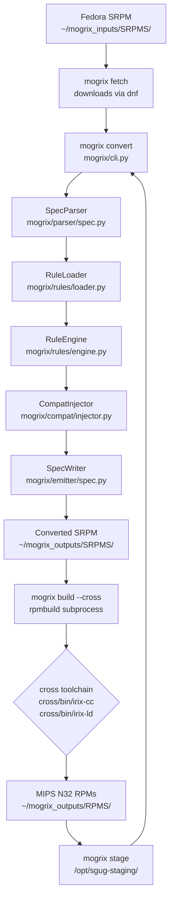
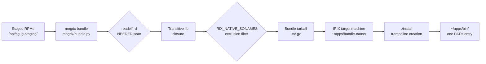

# Mogrix Architecture Overview

## 1. System Purpose

Mogrix is a cross-compilation pipeline that transforms software source packages (Fedora SRPMs, upstream git repositories, and tarballs) into deployable IRIX packages targeting MIPS N32 ABI on SGI IRIX 6.5.x. It addresses the fundamental incompatibility between modern Linux-hosted build environments and the discontinued IRIX OS by wrapping `rpmbuild` in a declarative YAML rule engine that rewrites spec files, injects missing POSIX/C99 compatibility functions, applies source patches, and manages a staging area that satisfies inter-package header and library dependencies — producing both individual RPMs and self-contained app bundles that install without network access on a live IRIX machine.

---

## 2. Major Components

### CLI (`mogrix/cli.py`)

The Click-based entry point (`main()` group, `mogrix/cli.py:~80`) dispatches all user-facing commands: `convert`, `build`, `fetch`, `stage`, `bundle`, `create-srpm`, `transform`, `batch-build`, `roadmap`, `patch-crates`, and others. It owns directory constants (`RULES_DIR`, `COMPAT_DIR`, `STAGING_DIR`, etc., `mogrix/cli.py:~19–28`) and enforces cross-tool consistency by checksumming compiler wrappers against staging copies via `_check_tool_checksums()` (`mogrix/cli.py:~47`).

### Rule Engine (`mogrix/rules/engine.py`, `mogrix/rules/loader.py`)

The rule engine applies YAML-declared transforms to an RPM spec file, producing a `TransformResult` that carries the modified spec and metadata about applied transforms. The loader (`RuleLoader`) reads per-package YAML files from `rules/packages/`, class rules from `rules/classes/`, and a global `rules/generic.yaml`. Rule keys — `inject_compat_functions`, `drop_buildrequires`, `configure_disable`, `ac_cv_overrides`, `remove_lines`, etc. — map directly to operations the engine executes against the parsed spec.

### Spec Parser and Emitter (`mogrix/parser/spec.py`, `mogrix/emitter/spec.py`)

`SpecParser` reads an SRPM's spec file using the `specfile` library and exposes it as a structured object. `SpecWriter.write()` (`mogrix/emitter/spec.py:~57`) accepts a `TransformResult` and a set of computed parameters (compat source injections, patch statements, autoconf cache overrides, macro definitions, line removals, regex replacements) and produces a `WriteResult` (`mogrix/emitter/spec.py:~27`) containing the modified spec text plus a `ReplacementMatch` audit trail for every applied transformation.

### Compat Injector (`mogrix/compat/injector.py`)

When a package rule lists `inject_compat_functions`, the `CompatInjector` resolves each function name against the implementations in `compat/` (35+ functions: `openat` family, `posix_spawn`, `getline`, `vasprintf`, `open_memstream`, `explicit_bzero`, etc.). It generates the `Source:` declarations and `%build` stubs needed to compile and link these implementations into the target package. The dlmalloc allocator is handled separately by the linker wrapper (`cross/bin/irix-ld`) and injected only into executables.

### Staging System (`mogrix/staging.py`)

The staging area at `/opt/sgug-staging/` is both a cross-compilation sysroot extension and the deployment point for compiler wrappers. `stage` extracts RPM payloads so subsequent builds can resolve `-I/opt/sgug-staging/usr/sgug/include` and `-L/opt/sgug-staging/usr/sgug/lib32`. The `ensure_staging_ready()` function (imported in `mogrix/cli.py:~14`) verifies the staging directory is present before any build command proceeds.

### Cross-Compilation Toolchain (`cross/`)

The `cross/` directory contains compiler wrappers (`cross/bin/irix-cc`, `cross/bin/irix-ld`), pre-built IRIX-targeted C++ standard library headers (`cross/include/c++/9/mips-sgi-irix6.5/bits/c++config.h`), runtime CRT objects, and linker scripts. `irix-cc` wraps clang 16+ with flags for MIPS N32 ABI; `irix-ld` wraps patched LLD 18 with IRIX-specific settings. These tools are checksummed against their staging copies on every invocation (`mogrix/cli.py:~47–68`).

### Bundle Generator (`mogrix/bundle.py`)

`mogrix bundle` creates self-contained IRIX app tarballs. It scans binaries with `readelf -d` to collect `NEEDED` sonames, resolves the transitive closure of shared library dependencies from the staging area, applies the `IRIX_NATIVE_SONAMES` exclusion set (`mogrix/bundle.py:~52–62`) to avoid bundling libraries that must come from IRIX itself, handles dlopen plugin directories via `PLUGIN_DIR_ENV_MAP` (`mogrix/bundle.py:~76–83`), and generates Bourne-compatible wrapper scripts (not POSIX sh — IRIX `/bin/sh` is original Bourne, per the comment at `mogrix/bundle.py:~88`) and trampoline installers.

### Roadmap Resolver (`mogrix/roadmap.py`)

`RoadmapResolver` (`mogrix/roadmap.py:~72`) resolves the transitive build-dependency graph for a target package by querying an SQLite database of Fedora package metadata, classifying each dependency using the `Classification` enum (`mogrix/roadmap.py:~18`: DROPPED, SYSROOT, ALREADY_BUILT_VERIFIED, HAS_RULES, NEED_RULES, UNRESOLVABLE, etc.), and producing a topologically sorted `RoadmapResult` (`mogrix/roadmap.py:~55`). Classification uses four pre-loaded data sets: `sysroot_provides.yaml`, `non_fedora_packages.yaml`, built RPM scan, and the rule package list.

### Rebuild Orchestrator (`mogrix/rebuild.py`)

`mogrix rebuild-all` manages versioned build workspaces (`~/mogrix_v10`, `~/mogrix_v11`, … — `mogrix/rebuild.py:~24`), maintains a `~/mogrix_outputs` symlink to the active workspace, runs gate 0 (staging reset) and gate 2 (ELF ABI validation via `mogrix/gates.py`) around each package build, and invokes the mogrix binary from `.venv/bin/mogrix` directly to avoid `uv` lock contention (`mogrix/rebuild.py:~39`).

### Source Analysis and Patch Layer (`analysis/`, `patches/`)

The `analysis/` module scans source tarballs with ripgrep for IRIX-incompatible patterns (`%zu` format strings, `__thread` TLS, `epoll`/`inotify` usage) defined in YAML rule files. The `patches/` directory contains 171 patch files applied by spec rules, including patches to upstream C/C++ sources (e.g., `patches/packages/ir8/ir8-window.c`, `patches/packages/worker/searchopbg.cc`) and Rust crate modifications (e.g., `patches/crates/libc/unix/irix/mod.rs` which defines IRIX 6.5 N32 ABI struct layouts verified empirically on hardware).

---

## 3. Data Flow

The primary SRPM conversion and build path:

The bundle path diverges after staging:

---

## 4. Key Abstractions

**`TransformResult`** (`mogrix/rules/engine.py`) — The central value passed from the rule engine to the spec writer. It carries the parsed `SpecParser` object plus all computed transform parameters accumulated by the engine as it processes rule keys. Every downstream writer operation is driven entirely by this object.

**`WriteResult`** (`mogrix/emitter/spec.py:27`) — Returned by `SpecWriter.write()`. Contains the final spec text as `content: str` plus `all_matches: list[ReplacementMatch]` and `unmatched: list[ReplacementMatch]` for audit. The `unmatched_required` property (`mogrix/emitter/spec.py:38`) surfaces failures where a non-optional replacement pattern found nothing — essential for catching spec drift when a package upgrades.

**`RoadmapResolver`** (`mogrix/roadmap.py:72`) — Abstracts the entire dependency classification problem. Callers supply a target package name; the resolver handles SQLite queries, drop-list lookups, sysroot matching, and cycle detection internally, returning a `RoadmapResult` with a topologically sorted `build_order: list[str]`.

**`Classification` enum** (`mogrix/roadmap.py:18`) — The shared vocabulary for package status across the roadmap, batch-build, and reporting subsystems. Seven states from DROPPED to UNRESOLVABLE allow the batch builder to make automated decisions (skip SYSROOT, proceed with HAS_RULES, generate candidates for NEED_RULES) without inspecting raw data.

**`MipsElf`** (`tools/rld-harness.py:~88`) — A pure-Python, struct-based MIPS N32 ELF parser that reads GOT metadata (`DT_MIPS_LOCAL_GOTNO`, `DT_MIPS_GOTSYM`, `DT_MIPS_SYMTABNO`) directly from binary without shelling out to `readelf`. It exists because the IRIX runtime linker (`rld`) has a hard limit of 4370 global GOT entries (`tools/rld-harness.py:23`) and a local GOT re-encounter danger zone at 128 entries, both derived from `docs/rld/rld_full_decompile.c` decompilation analysis.

**YAML Rule Files** (`rules/packages/*.yaml`) — The primary extension point. A package maintainer adds a YAML file to get a new package into the pipeline; no Python code changes are needed. Rule keys are processed by the engine in a fixed order; the schema is validated by `mogrix validate-rules`.

---

## 5. Threading and Concurrency Model

Mogrix's Python core is single-threaded. Concurrency occurs only at the process boundary: `rpmbuild` is launched as a subprocess by `mogrix build`, and `mogrix rebuild-all` (`mogrix/rebuild.py`) runs packages sequentially in dependency order, waiting for each subprocess to finish before proceeding. The `rebuild.py` module disables Rich terminal buffering explicitly (`console = Console(force_terminal=False)`, `mogrix/rebuild.py:30`) so log output streams in real time when stdout is redirected. The `searchopbg.cc` patch (`patches/packages/worker/searchopbg.cc:28`) contains a comment acknowledging that its `SearchOpBG` result store is "NOT REALLY THREAD-SAFE" — but this is third-party source code being patched, not mogrix infrastructure.

---

## 6. External Dependencies

| Dependency | Where Declared | Why Needed |
|---|---|---|
| `pyyaml` | `pyproject.toml` | Loads all rule files (`rules/packages/*.yaml`, `rules/generic.yaml`, `rules/transforms/*.yaml`) |
| `click` | `pyproject.toml` | CLI command dispatch and option parsing (`mogrix/cli.py`) |
| `rich` | `pyproject.toml` | Terminal tables, progress, colored output throughout CLI and rebuild orchestrator |
| `specfile` | `pyproject.toml` | Structured RPM spec file parsing; provides the object model that `SpecParser` wraps |
| `mcm-engine` (local) | `pyproject.toml` | Local dependency at `file:///home/edodd/projects/github/unxmaal/mcm-engine`; purpose not derivable from provided excerpts |
| `rpmlint` (optional) | `pyproject.toml` | RPM/spec linting with IRIX-specific config (`rpmlint.toml`) |
| `tree-sitter` + language grammars (optional) | `pyproject.toml` | AST-level source analysis for the `ast` extras group |
| **clang 16+** (system) | `docs/setup-guide.md`, `cross/bin/irix-cc` | C/C++ cross-compiler targeting MIPS N32 — must be the upstream build with MIPS target enabled |
| **LLD 18 (patched)** (system) | `scripts/build-lld-irix.sh` | IRIX-specific linker; upstream LLD requires patches for IRIX MIPS N32 ABI quirks |
| **GNU Binutils 2.41** (system) | README | `mips-sgi-irix6.5` target; provides `objcopy`, `readelf`, BFD `ld` fallback |
| **rpmbuild** (system) | `mogrix/cli.py` | Executes the actual package build; mogrix is a wrapper around it, not a replacement |
| **ripgrep** (system) | README, `analysis/` | Source scanning for IRIX-incompatible patterns; patterns defined in YAML so no code change is needed to add checks |
| **dnf/yum** (system) | `mogrix fetch` | Downloads SRPMs from Fedora 40 or Photon OS repositories |
| **IRIX sysroot** (external) | README | System headers and libraries from a live IRIX machine at `/opt/irix-sysroot/`; not distributed with mogrix |

